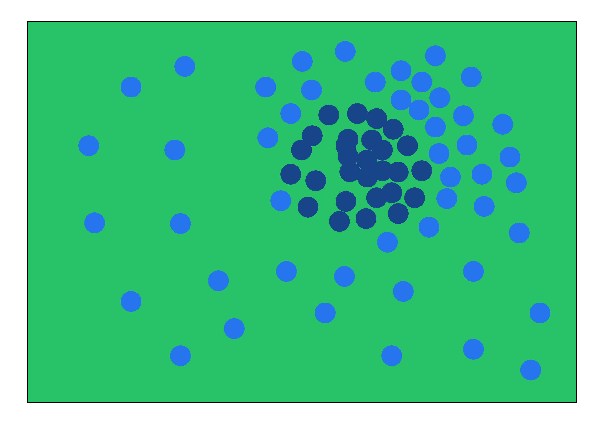

# Дизайн композиций
## Композиционный центр
### Пастельный цвет
.png)
### Родственные цвета
center.jpg)
## Динамика
### Доп. цвета
.png)
### Ахроматический цвет (форма)
.png)
.png)
.png)
### Монохромный цвет
.png)
### Пастельный цвет
.png)
### Родственные цвета

## Статика
### Пастельные цвета
.png)