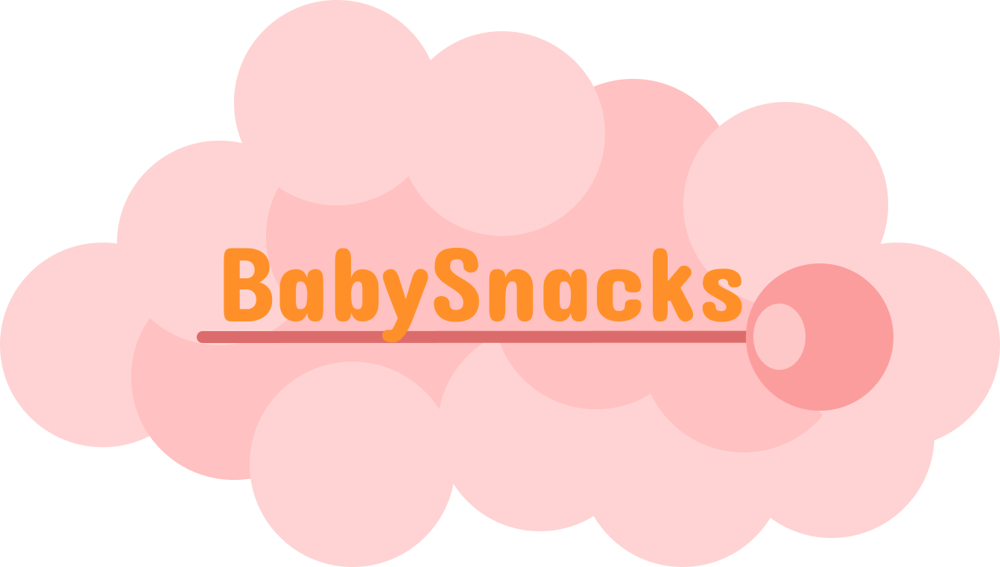
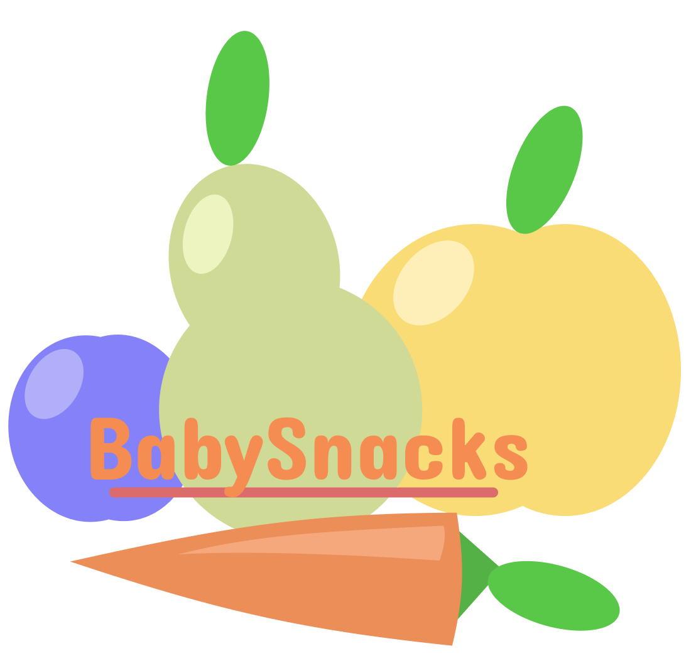
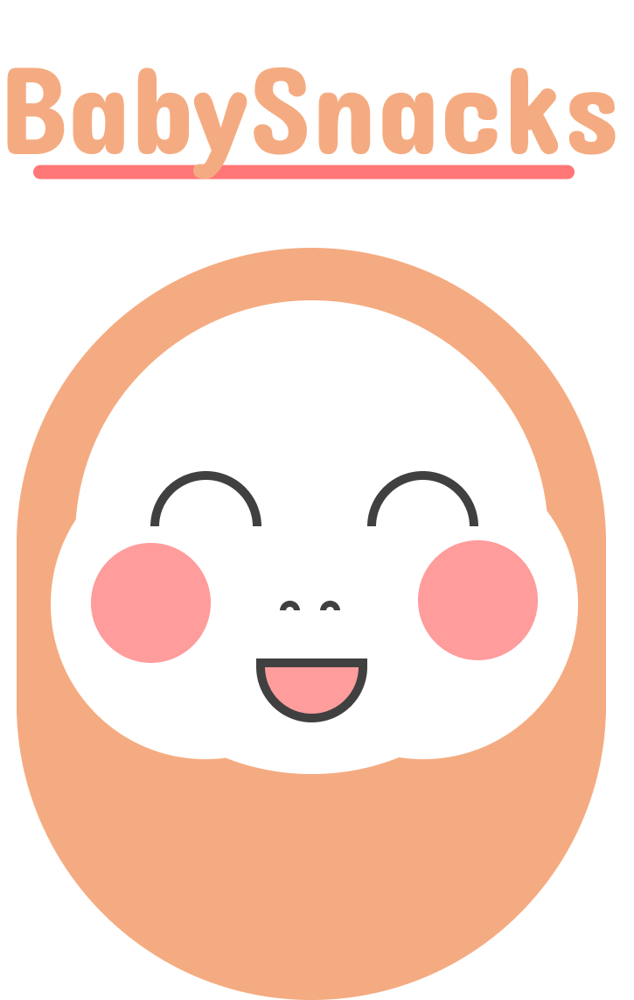
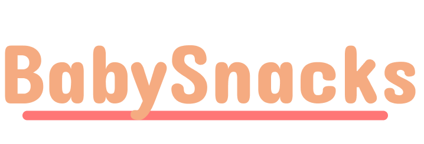
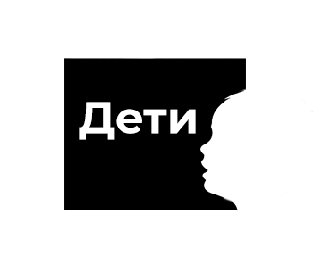
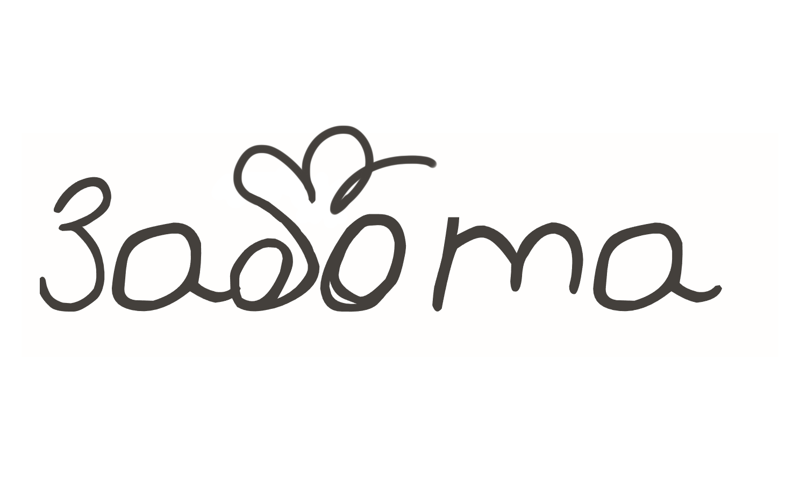
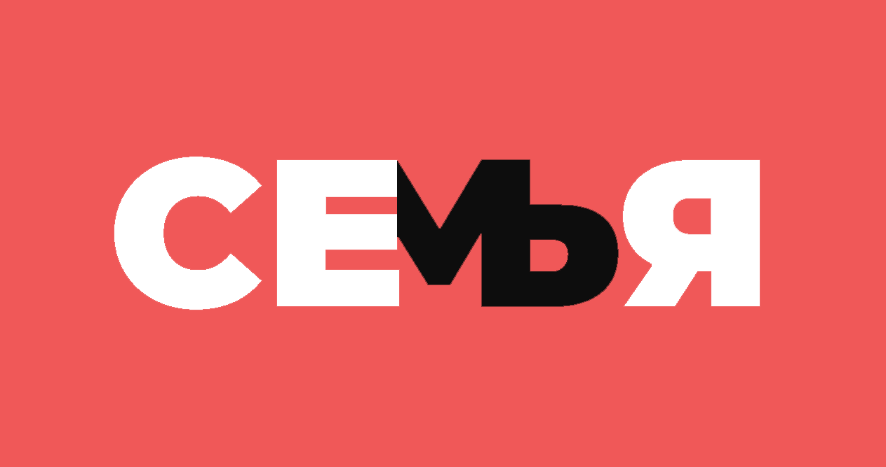
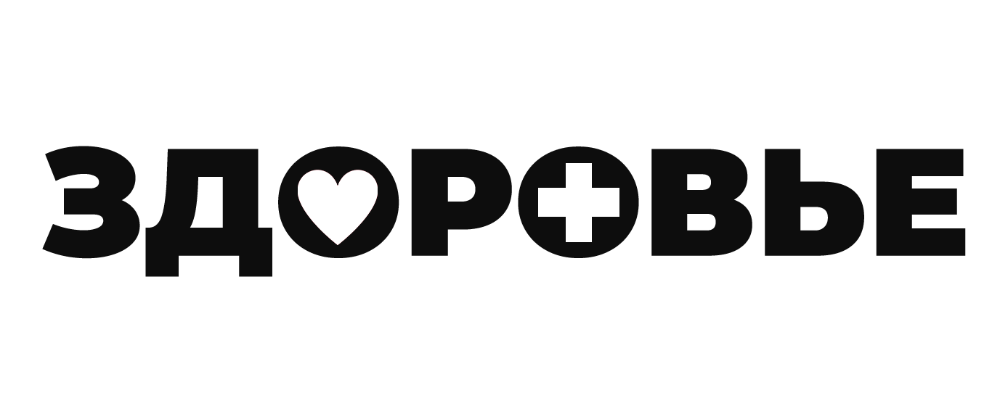
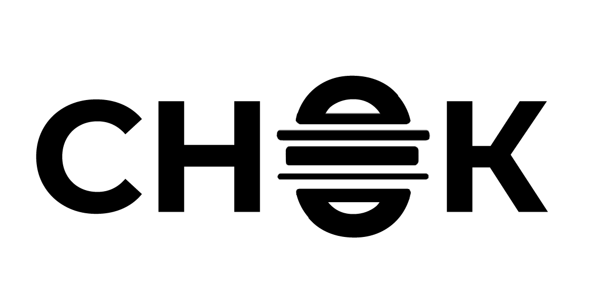
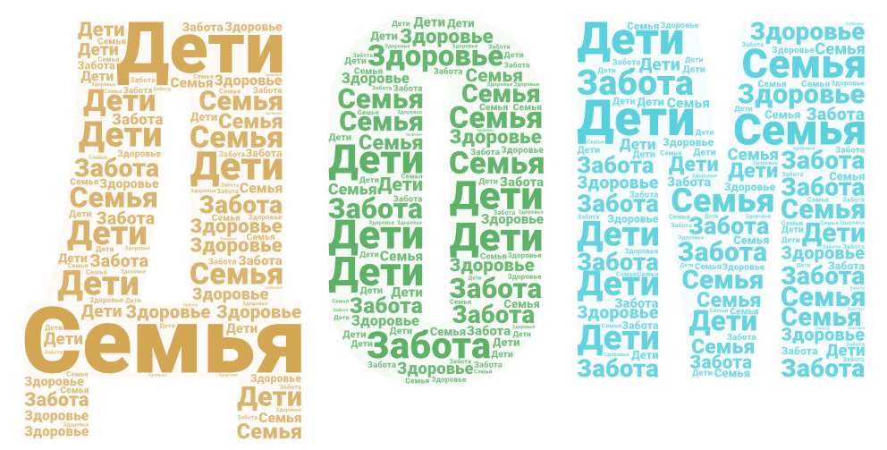

# Проект брифа
## Нужно было разработать элементы айдентики для условной компании по изготовлению детского питания
## Логотипы

----

----

----

## Контрформы (ассоциации, связанные с детским питанием)

----

----

----

----

----

