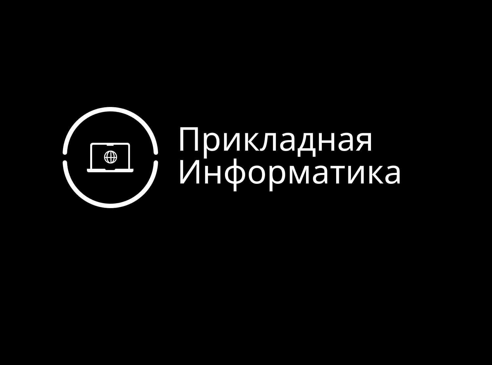
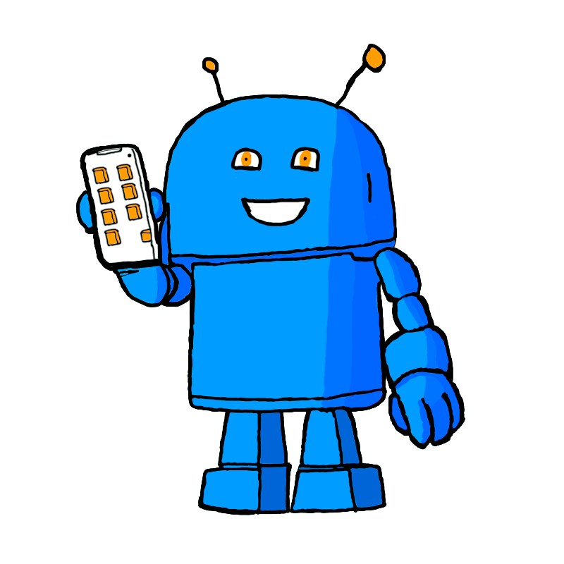
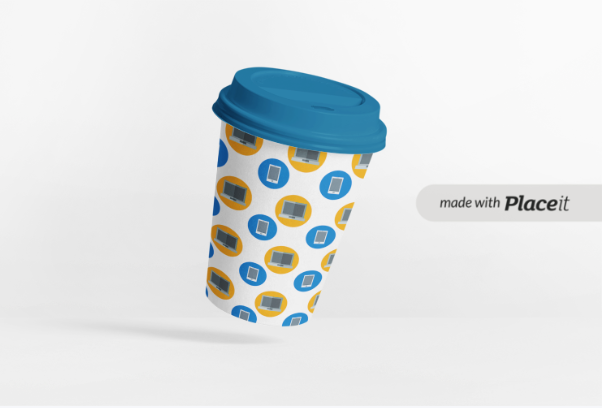
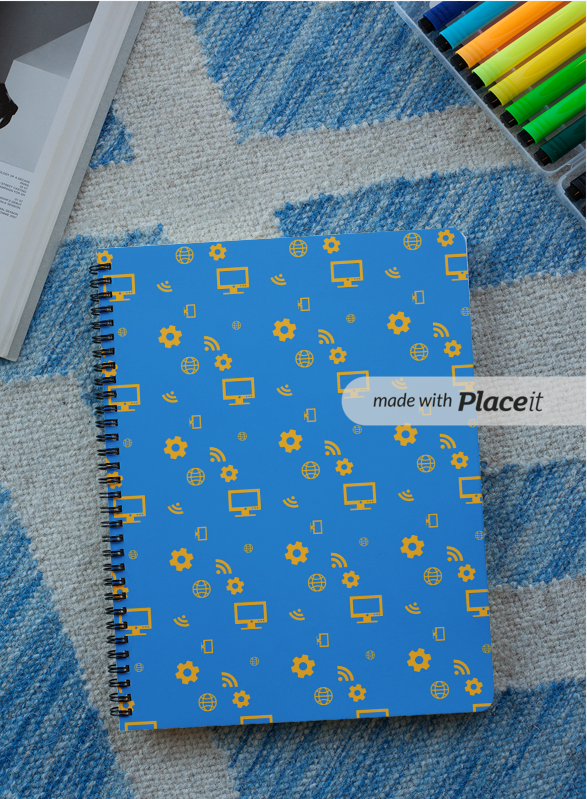
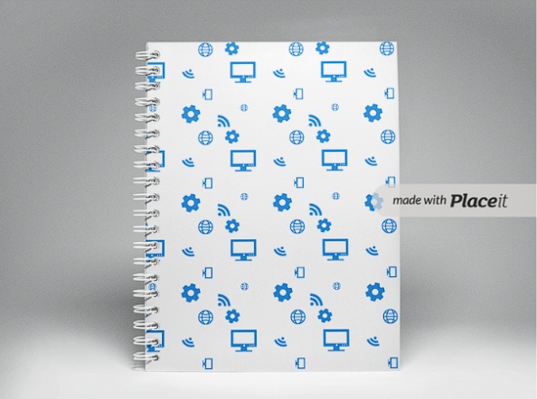
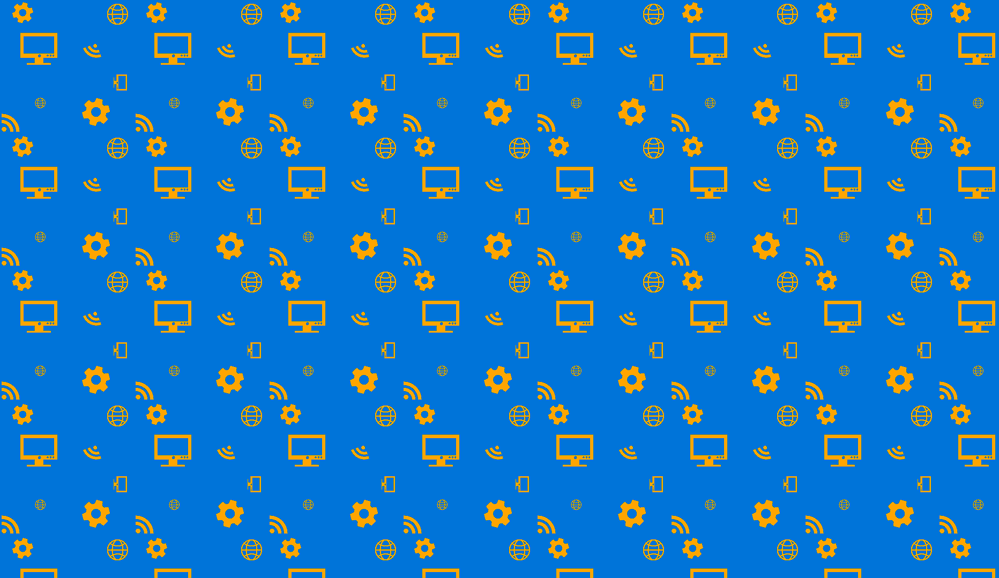
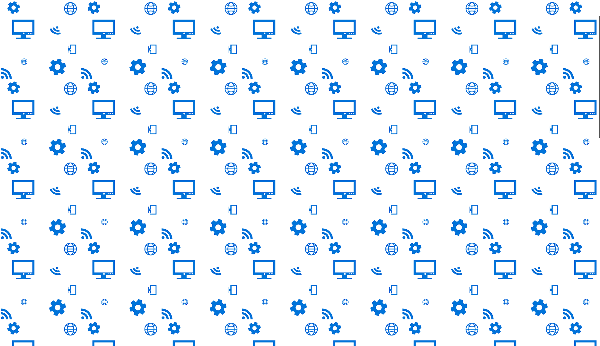

# Создание набора айдентики на тему "Прикладная информатика"
## Логотипы

## Темная версия логотипа

## Маскот

## Мокапы
### Стакан

### Полный набор инструментов

### Блокноты

### Бумажный пакет

### Одежда

## Паттерны

## Социальные сети
### Страница веб-сайта

### Инстаграм

