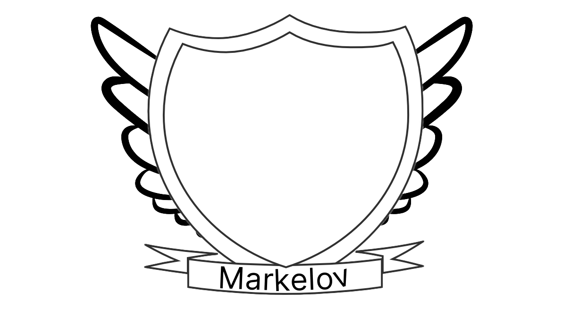

# Фамильный герб
- На этом гербе использованы простые элементы оформления, такие как два крыла, щит и надпись с фамилией. 
    - Два крыла могут символизировать свободу, мудрость и легкость. 
    - Щит – это символ защиты и защиты семьи. 
    - Надпись с фамилией на ленте помогает идентифицировать фамилию, которую герб представляет.
  
# Изображение герба
